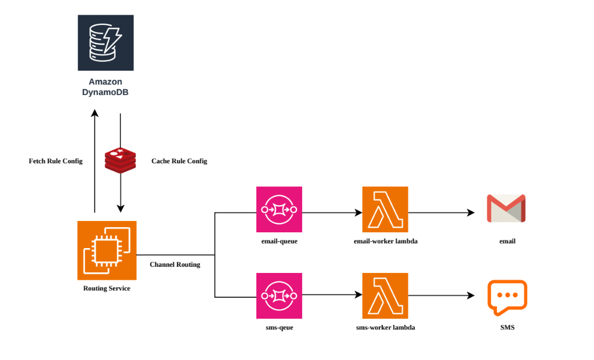

# Policy-Driven Message Routing System

## 📌 Overview

This project implements a **Policy-Driven Message Routing System** that decides **how, when, and where** notifications are delivered based on configurable rules and runtime conditions.

The system is designed as per the **Grootan Technologies – Policy Driven Routing Engine Assessment**.

The architecture follows an **asynchronous, decoupled design** using AWS services for scalability and fault tolerance.

---

## 🏗️ High Level Design (HLD)



---

## ✅ Core Features (Assessment Mapping)

| Requirement          | Implementation                              |
| -------------------- | ------------------------------------------- |
| Policy-based routing | Rules engine with priorities and conditions |
| Channel abstraction  | Email & SMS channel interfaces              |
| Rules engine         | Config-driven rule evaluation               |
| Async processing     | AWS SQS queues                              |
| Worker processing    | AWS Lambda consumers                        |
| Failure handling     | Retry mechanism + Dead Letter Queues        |
| Message tracking     | Lifecycle state persistence                 |

---

# 🧠 Message Lifecycle

```

CREATED → ROUTED → PROCESSING → DELIVERED
↓
FAILED

```

Each state transition is stored in the **notification database** to allow:

- Debugging
- Querying delivery status
- Tracking message flow

---

# 📂 Project Structure

## Routing Service (Spring Boot)

```

routing-service
├── controller
├── service
├── rules
├── channel
├── repository
├── model
├── config
└── util

```

Responsibilities:

- Accept notification requests
- Evaluate routing policies
- Determine appropriate channels
- Push messages to corresponding **SQS queues**
- Track message state

---

## Worker Service (AWS Lambda)

```

notification-worker
├── handler
├── service
├── channel
├── model
└── util

```

Responsibilities:

- Consume messages from SQS
- Dispatch notifications to external providers
- Update delivery status

---

# ⚙️ Prerequisites

Ensure the following are installed:

- **Java 17**
- **Gradle**
- **AWS Account**
- **AWS CLI configured**
- IAM permissions for:
  - SQS
  - Lambda

---

# ☁️ AWS Setup Instructions

## 1️⃣ Create SQS Queues

Create the following queues in AWS:

| Channel | Queue Name                 |
| ------- | -------------------------- |
| Email   | `notification-email-queue` |
| SMS     | `notification-sms-queue`   |

### Optional Dead Letter Queues

| DLQ Name                 |
| ------------------------ |
| `notification-email-dlq` |
| `notification-sms-dlq`   |

Dead letter queues help capture failed messages after retry attempts.

---

## 2️⃣ Copy Queue URLs

After creating the queues, copy their **Queue URLs**.

These will be used in the **Routing Service configuration**.

Example:

```

https://sqs.ap-south-1.amazonaws.com/<account-id>/notification-email-queue

```

---

# 🔧 Routing Service Configuration

Update the `application.yml` file:

```yaml
aws:
  sqs:
    emailQueueUrl: https://sqs.ap-south-1.amazonaws.com/<account-id>/notification-email-queue
    smsQueueUrl: https://sqs.ap-south-1.amazonaws.com/<account-id>/notification-sms-queue
```

---

## 🔐 Environment Variables

Ensure lambda environment variables are set:

```bash
export GMAIL_USERNAME=xxxx
export GMAIL_APP_PASSWORD=xxxx

```

---

## 🔗 Service Endpoints Reference

### 📍 Routing Service (Spring Boot)

| Category         | Path                                   | Description                     |
| ---------------- | -------------------------------------- | ------------------------------- |
| Base Service URL | http://localhost:8080                  | Root URL of the routing service |
| Swagger UI       | http://localhost:8080/swagger-ui.html  | API documentation & testing UI  |
| OpenAPI Docs     | http://localhost:8080/v3/api-docs      | Swagger JSON specification      |
| Actuator Base    | http://localhost:8080/actuator         | Spring Boot actuator endpoints  |
| Health Check     | http://localhost:8080/actuator/health  | Application health status       |
| Metrics          | http://localhost:8080/actuator/metrics | Application metrics             |

---

## 🧩 Design Trade-offs

| Decision            | Chosen Approach             | Trade-off                                                                       |
| ------------------- | --------------------------- | ------------------------------------------------------------------------------- |
| Rule Storage        | Database-backed rules       | ✅ Dynamic updates without redeploy<br>❌ Requires DB reads & schema management |
| Rule Evaluation     | Runtime DB evaluation       | ✅ Flexible & extensible<br>❌ Slight latency compared to in-memory rules       |
| Routing Logic       | Centralized routing service | ✅ Single source of truth<br>❌ Routing service is a critical path              |
| Async Processing    | AWS SQS                     | ✅ Decoupling & durability<br>❌ Eventual consistency                           |
| Queue Strategy      | One SQS per channel         | ✅ Isolation & retries<br>❌ More infrastructure components                     |
| Worker Model        | AWS Lambda                  | ✅ No server management<br>❌ Cold starts                                       |
| Lambda Batch Size   | Batch size = 5              | ✅ Safe retries<br>❌ Lower throughput                                          |
| Failure Handling    | Retry + DLQ                 | ✅ Message durability<br>❌ DLQ monitoring required                             |
| State Tracking      | Notification DB             | ✅ Observability & audit trail<br>❌ Extra write operations                     |
| Channel Abstraction | Interface-based design      | ✅ Easy to add new channels<br>❌ Slight abstraction overhead                   |

---
